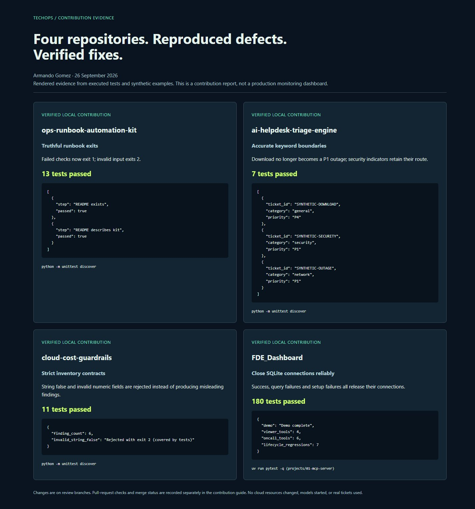
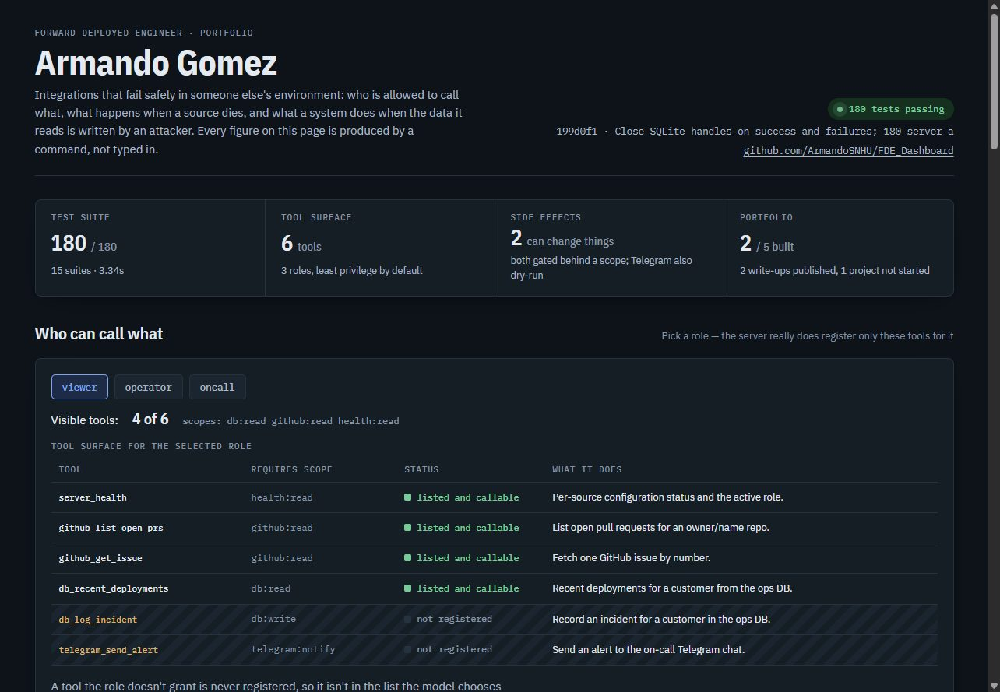

# Four repository reliability contributions
Author: Armando Gomez
Date: 2026-09-26

## Results and review status
Four public repositories owned by ArmandoSNHU were selected for their operational relevance and reproducible defects. Each patch is on `contribution/techops-reliability`, with a separate pull request. Main branches have not been merged automatically. These are contributions to the owner's projects; no external maintainer acceptance is claimed.

| Repository / pull request | Reproduced problem and fix | Verified local suite |
|---|---|---|
| [ops-runbook-automation-kit #1](https://github.com/ArmandoSNHU/ops-runbook-automation-kit/pull/1) | Failed checks exited 0. Now success is 0, failed checks 1, invalid/incomplete execution 2; malformed and empty runbooks are rejected. | 13 tests OK |
| [ai-helpdesk-triage-engine #1](https://github.com/ArmandoSNHU/ai-helpdesk-triage-engine/pull/1) | `download` matched `down` and became P1; endpoint keywords could overwhelm ransomware routing. Shared keyword boundaries and explicit security precedence fix these cases. | 7 tests OK |
| [cloud-cost-guardrails #1](https://github.com/ArmandoSNHU/cloud-cost-guardrails/pull/1) | String `false` became public exposure; invalid cost/port/age values passed coercion. Strict shared validation now rejects ambiguous input. | 11 tests OK |
| [FDE_Dashboard #1](https://github.com/ArmandoSNHU/FDE_Dashboard/pull/1) | SQLite transaction contexts did not close connections. Handles now close after success, query failure and setup failure. | 180 server tests + 34 evaluation tests passed |

Each defect was reproduced before its fix. Local tests use synthetic inputs, temporary files/databases and mocked transports. No cloud resources were changed, no real support ticket was processed, and no model was downloaded or started. Publication checks inspected changed files for common secret patterns; images were reviewed separately. This is a bounded review rather than a guarantee against every possible secret format.

## Why these four
- **Runbooks:** repeatable checks and process exit codes are the foundation of reliable operations automation.
- **Helpdesk triage:** understandable routing avoids false escalations and provides a practical ticket-intake contract.
- **Cloud guardrails:** trustworthy input handling prevents malformed inventory from turning into misleading security or cost findings.
- **FDE integration:** resource lifetime, failure isolation and reproducible evidence demonstrate reliability across components.

These projects could inform future TechOpsagent integrations. This round used the evidence-first workflow to improve their code; TechOpsagent itself does not yet clone repositories, fix code or submit PRs automatically.

## Evidence snapshots
The first image is a real Chrome capture of an evidence report rendered from executed test results and synthetic CLI examples. It is not a live infrastructure dashboard. The JSON record includes commands, timestamps and outputs. The second image is the actual FDE dashboard served from the contribution branch, with test figures regenerated from the corrected code.





- [Machine-readable verification](contributions/verification.json)
- [Standalone evidence report](contributions/evidence.html) — save/open locally; it contains no scripts or external requests.

## Reproduce and learn from the work
Use the contribution branch to reproduce results before merging. Each repository's `docs/CONTRIBUTION.md` explains the root cause, compatibility changes and commands; FDE keeps it under `projects/01-mcp-server/docs/`.

For the three standard-library projects:
```powershell
git fetch origin
git switch contribution/techops-reliability
python -m unittest discover
```
Run those commands in a clean checkout of the relevant repository. Existing unrelated local work should be preserved. Python 3.10+ is supported by their current CI.

| Practice exercise | What to examine | Evidence of learning |
|---|---|---|
| Runbook failure | Run a synthetic missing-file check and inspect `$LASTEXITCODE` immediately. Compare JSON output and process status. | Explain why a failed check must not look successful to a scheduler. |
| Triage false positives | Run `python -m ai_helpdesk_triage data/matching_regressions.json --pretty`. Add a new boundary case in a test. | Explain the difference between keyword evidence and semantic understanding; discuss negation limitations. |
| Cloud input validation | Compare sample_inventory.json with invalid_inventory.json. Test a new malformed field using a synthetic record. | Explain why rejecting ambiguous data is preferable to silently coercing it; distinguish findings from verified savings. |
| SQLite cleanup | In FDE project 01, run `uv run pytest -q tests/test_sqlite_lifecycle.py`, then the full suite. | Explain transaction commit/rollback versus connection closure and how the test prevents garbage collection from hiding a leak. |

For FDE, follow its documented `uv sync --frozen`, demo, stdio smoke and evaluation commands. The rule-based evaluation stays at 94.6% with zero unsafe decisions; this is not a measured score for a live model.

## Use the pull requests as a learning record
1. Open **Files changed** and follow a failing regression through the smallest implementation change that fixes it.
2. Read the contribution document and compare its claims with test output and CI checks.
3. Reproduce one case yourself, then add a test of your own before changing behavior.
4. Explain the compatibility effects: runbook exit codes, strict inventory fields and security routing are intentional behavior changes.
5. Review and merge each PR when satisfied. The FDE public dashboard updates after its main-branch deployment; a PR preview screenshot does not imply that deployment has happened.

For an interview or portfolio, describe the defect, the evidence, the fix and the verification you can personally reproduce. Distinguish assisted implementation from the parts you investigated and understood yourself. Useful topics include regression testing, CLI contracts, data validation, resource management and technical documentation.

## Remaining limits
Runbook network handling and path resolution are unchanged; execute only trusted runbooks. Triage is an English keyword heuristic and its legacy redactions field detects categories rather than removing values. Cloud findings are policy signals and can overlap; they are not confirmed cost savings. FDE outbox redelivery and live service/model validation remain separate work. None of these contributions claim a complete security audit or production readiness.

## Remote verification — 2026-09-26
All four PR test workflows passed:
- [Runbook CI](https://github.com/ArmandoSNHU/ops-runbook-automation-kit/actions/runs/36254719541): Python 3.10, 3.11 and 3.12, Ubuntu.
- [Triage CI](https://github.com/ArmandoSNHU/ai-helpdesk-triage-engine/actions/runs/36254727486): Python 3.10, 3.11 and 3.12, Ubuntu.
- [Cloud guardrails CI](https://github.com/ArmandoSNHU/cloud-cost-guardrails/actions/runs/36254735857): Python 3.10, 3.11 and 3.12, Ubuntu.
- [FDE CI](https://github.com/ArmandoSNHU/FDE_Dashboard/actions/runs/36254791424): server and evaluation suites on Windows and Ubuntu. Publishing was correctly skipped for a pull request.

The final local review found zero flagged items in the changed-file scans. FDE's existing tracked-file secret tests also passed. These changes are additive branches with normal pushes; no force-push, main-branch merge or history rewrite was performed.
