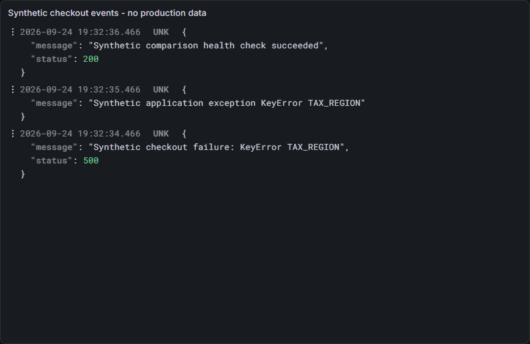
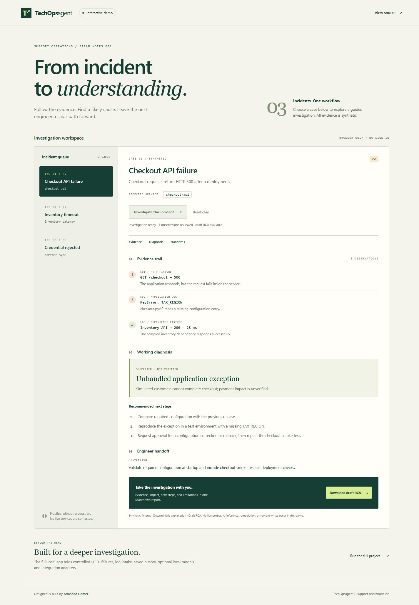
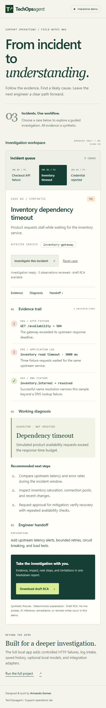
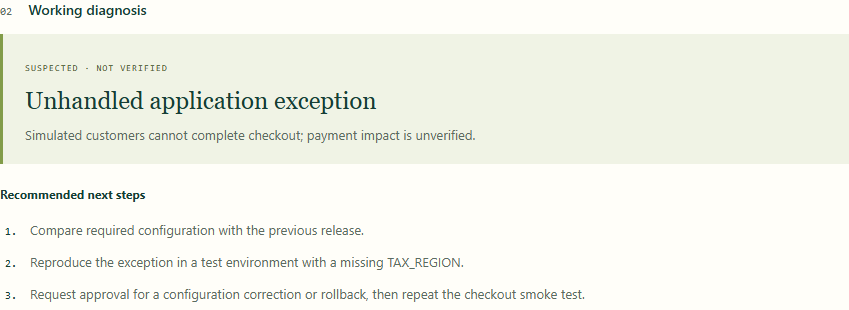
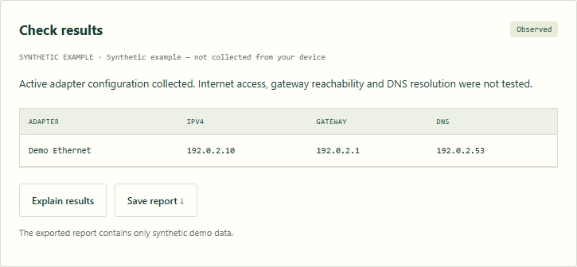
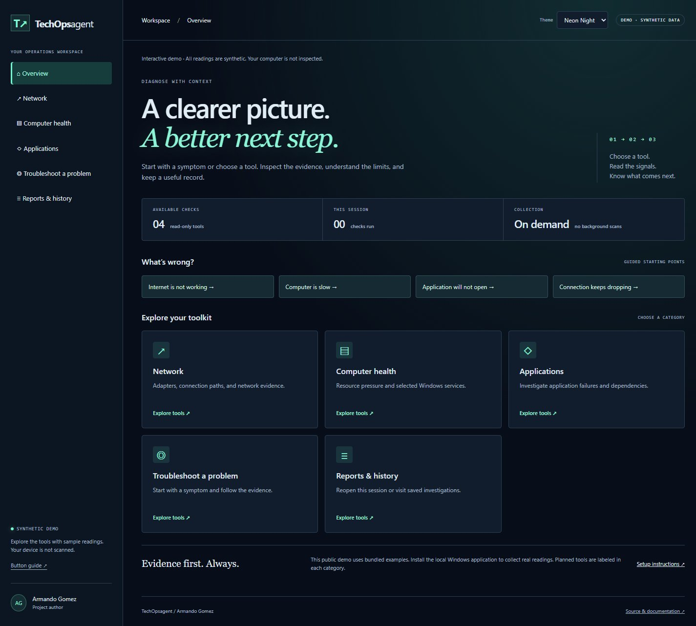

# Progress gallery
Author: Armando Gomez
Date: 2026-09-24

These are captures of the running application, not mockups. All incident data shown is synthetic.

## Desktop — dependency investigation
The incident workspace presents the intake scenario, suspected cause, evidence trail, next steps, report export, and saved history.

## Phone layout — credential investigation
Captured with a 390 px emulated viewport. The layout stacks intake, evidence, and history. Phone network access is a separate future feature; this image verifies layout only.

## Focused capture — investigation panel
Captured directly with Chrome DevTools element screenshot support. This cropped PNG keeps the suspected cause, evidence, recommended steps, and report link together. Windows Snipping Tool was not used.

## FastAPI migration
The restarted server reports framework fastapi. Report download returned 200, saved history reopened, and a 390 px viewport had no horizontal overflow.

## Observed local evidence
The application now measures a controlled HTTP failure and ranks the observed evidence. This focused Chrome capture shows HTTP 500, the healthy comparison, local resolution, and the cited rule score.

## Connected sources
Real Chrome element capture after the GitHub read completed. Grafana and Loki are visibly unconfigured.

## Connected sources
Real Chrome element capture after the GitHub read completed. Grafana and Loki are visibly unconfigured.

## Private local configuration
Fresh installs have no connected accounts. Local setup stores settings in ignored .env; tokens are entered with hidden prompts. Real Chrome capture of a clean settings profile:

## Live Grafana and Loki lab
Actual Chrome element capture from the local Grafana dashboard. All three events are synthetic and were ingested into the running Loki service.

## Published interactive demo — 2026-09-24
The [public demo](https://armandosnhu.github.io/TechOpsagent/) runs entirely from synthetic static assets. These are actual Chrome captures of the deployed HTTPS site, not design mockups. Desktop shows the checkout investigation; mobile shows the dependency-timeout case. The snippet isolates the draft diagnosis and troubleshooting steps. No real tickets, credentials, or local dashboards appear.

## Category-based diagnostic toolkit — 2026-09-25
Actual Chrome captures from the generated public artifact served locally. All visible readings are synthetic; real Windows validation retained only status/count summaries for documentation. Full button walkthrough: [TOOL-GUIDE.md](TOOL-GUIDE.md).

## Neon Night — 2026-09-25
Real Chrome capture of the synthetic dashboard with the new Theme selector. See TOOL-GUIDE.md for mobile capture and storage behavior.

