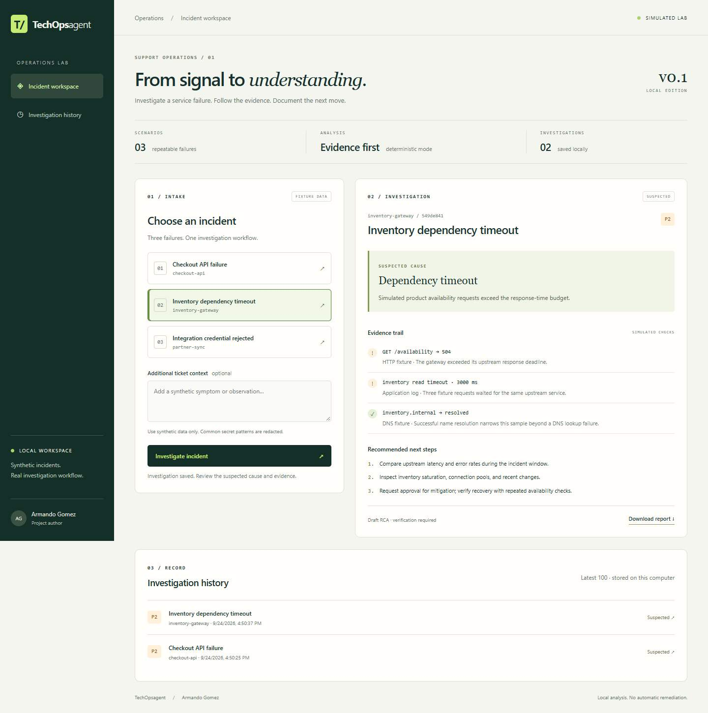
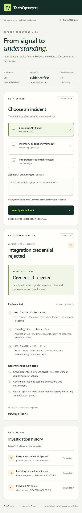
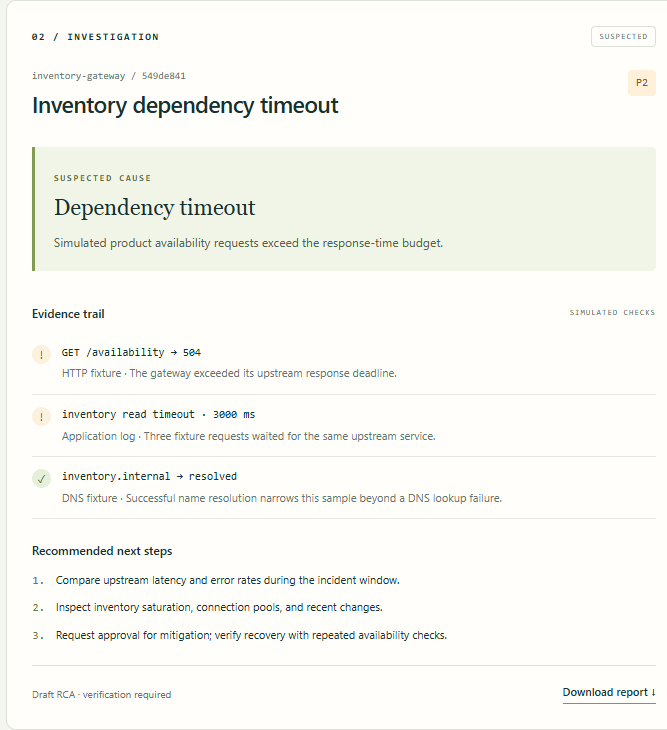
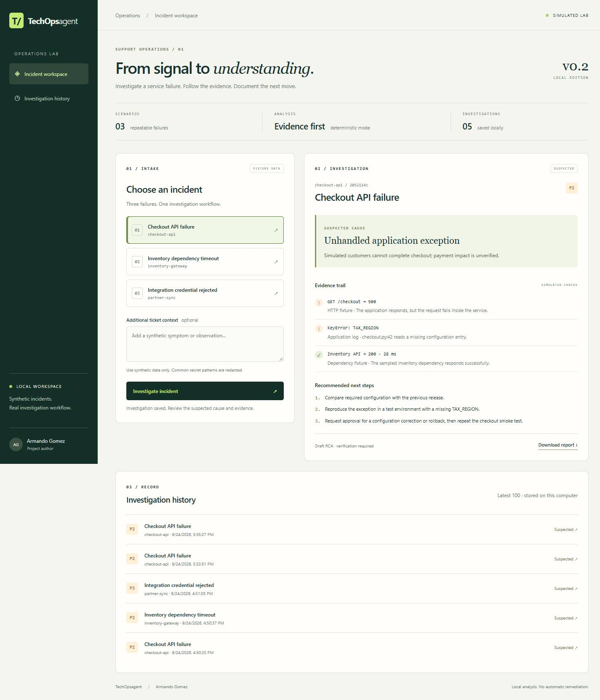
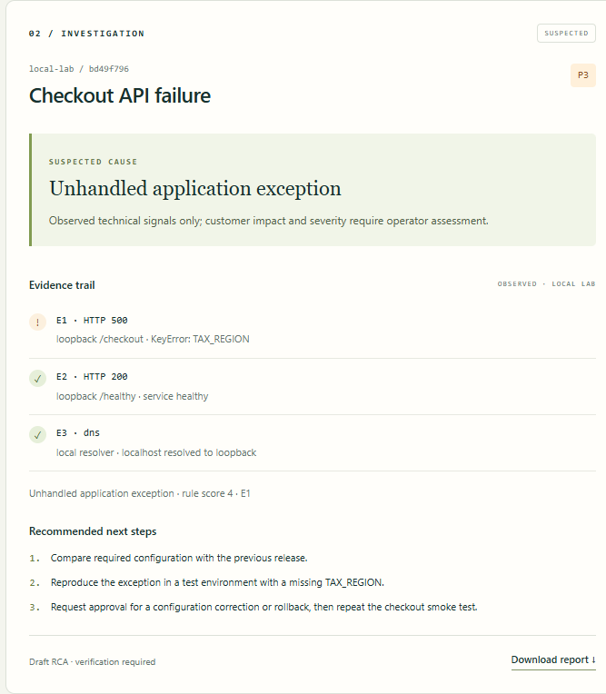
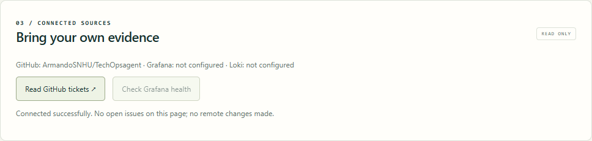
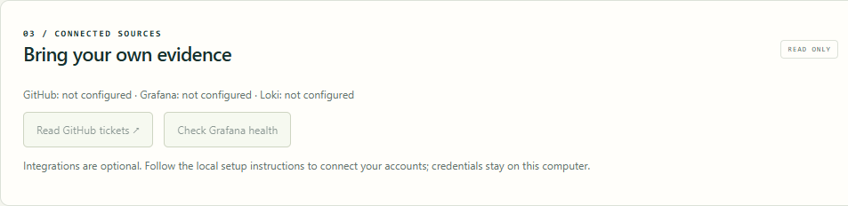

# Progress gallery
Author: Armando Gomez
Date: 2026-09-24

These are captures of the running application, not mockups. All incident data shown is synthetic.

## Desktop — dependency investigation
The incident workspace presents the intake scenario, suspected cause, evidence trail, next steps, report export, and saved history.

## Phone layout — credential investigation
Captured with a 390 px emulated viewport. The layout stacks intake, evidence, and history. Phone network access is a separate future feature; this image verifies layout only.

## Focused capture — investigation panel
Captured directly with Chrome DevTools element screenshot support. This cropped PNG keeps the suspected cause, evidence, recommended steps, and report link together. Windows Snipping Tool was not used.

## FastAPI migration
The restarted server reports framework fastapi. Report download returned 200, saved history reopened, and a 390 px viewport had no horizontal overflow.

## Observed local evidence
The application now measures a controlled HTTP failure and ranks the observed evidence. This focused Chrome capture shows HTTP 500, the healthy comparison, local resolution, and the cited rule score.

## Connected sources
Real Chrome element capture after the GitHub read completed. Grafana and Loki are visibly unconfigured.

## Connected sources
Real Chrome element capture after the GitHub read completed. Grafana and Loki are visibly unconfigured.

## Private local configuration
Fresh installs have no connected accounts. Local setup stores settings in ignored .env; tokens are entered with hidden prompts. Real Chrome capture of a clean settings profile:

