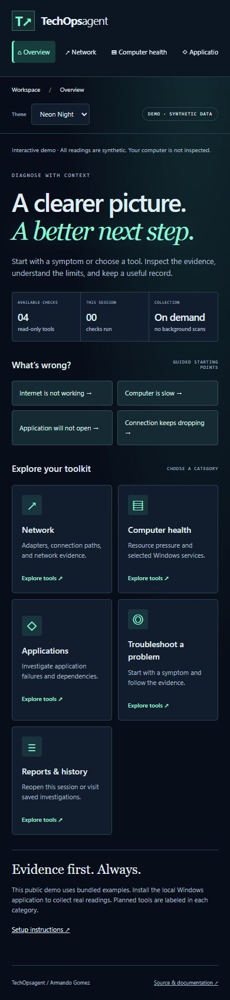
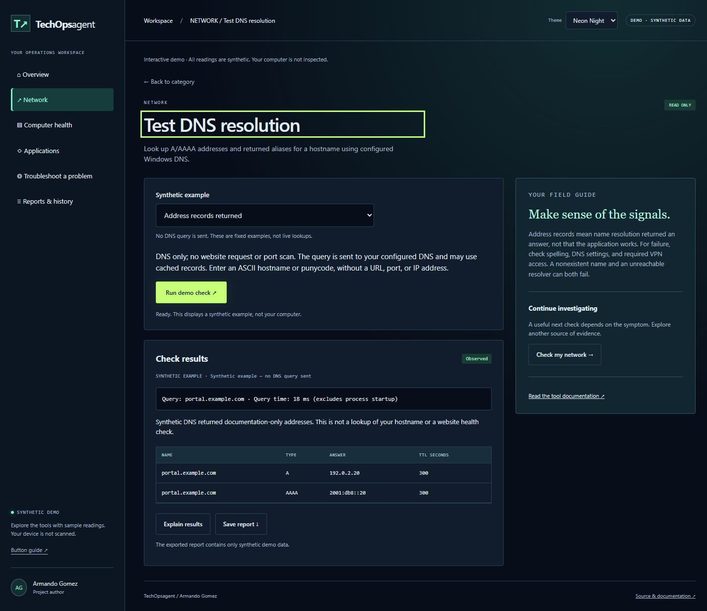
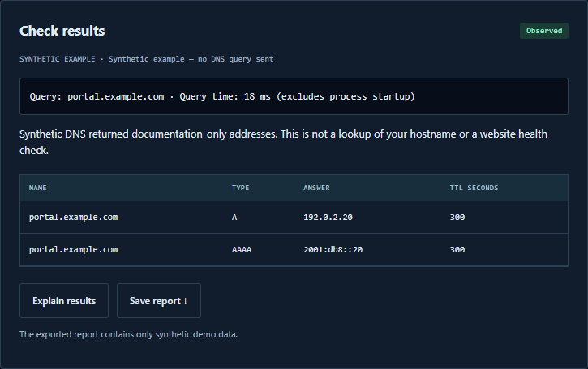
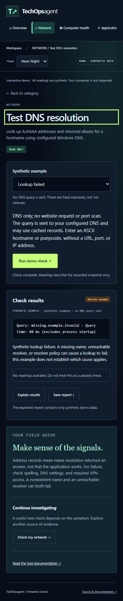
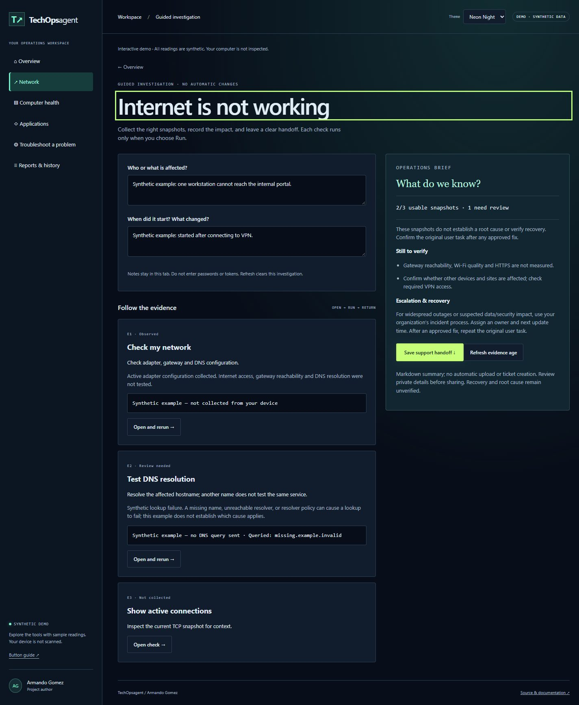
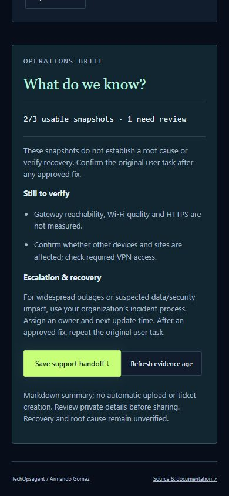

# Diagnostic toolkit: button guide
Author: Armando Gomez

## Start here
Open the [public demo](https://armandosnhu.github.io/TechOpsagent/) to explore synthetic examples. For actual Windows readings, follow [setup.md](../setup.md), run `./setup.ps1 -Run`, and open http://127.0.0.1:8765. The top badge identifies **DEMO · SYNTHETIC DATA** or **LOCAL · WINDOWS TOOLS**. Public Pages never inspects your computer. The local app has no account system and must stay bound to loopback.

## Light and Neon Night
Use **Theme** in the toolkit top bar to choose **Light** or **Neon Night**. Neon Night uses dark navy surfaces with mint and lime accents. Both themes cover overview cards, category directories, tool readings, explanations and session history. The separate legacy incident workspace retains its existing appearance.

The browser saves only `techops-theme` (`light` or `neon`) in localStorage. Diagnostic results remain in tab memory; changing themes does not save or upload readings. Preferences are separate for the public demo and each local origin. If browser storage is blocked, switching still works for the current page. Light is the default.

## Navigation
| Button | Opens | How to use it |
|---|---|---|
| Overview | Home dashboard | Choose a symptom shortcut or category card |
| Network | Adapter/connection tools and planned network tools | Open Check my network for your first snapshot |
| Computer health | Resource readings and selected services | Start with Check computer health for a slow computer |
| Applications | Incident workspace links and planned tools | Investigate an incident for evidence and an RCA; local log import lives there |
| Troubleshoot a problem | Available starting tools | Choose the check relevant to your symptom |
| Reports & history | Current-tab results plus saved incident investigations | Reopen a result or visit the separate incident workspace |
| All categories / Overview | Home dashboard | Return to the category menu |
| Back to category | The tool directory you came from | Choose another tool in that category |

The four Overview symptom buttons start guided investigations. Each provides an ordered sequence of existing checks, context notes, an evidence brief and support handoff. They do not establish a diagnosis. Selecting a symptom starts a fresh brief; Resume investigation preserves the current one.

## Run, understand, and save
1. Choose **Network → Check my network → Open tool**.
2. Read the tool's scope above the Run button.
3. Choose **Run local check** (Windows) or **Run demo check** (synthetic example).
4. Read the result status, timestamp, summary, and table. Rerun to obtain another snapshot; there is no background polling.
5. Choose **Explain results** to show the field guide's rule-based interpretation. No LLM is running; this is not a chat model's diagnosis.
6. Choose the suggested next-tool button to continue investigating. Each tool must be run separately.
7. Choose **Save report** to download a JSON file containing the selected result, author, collection time, and limitations. Save uses your browser's download behavior. Opening or navigating to another category never uploads a report.

## Available checks
| Tool | Actual local collection | Limits and interpretation |
|---|---|---|
| Check my network | Up to 32 active Windows adapter configurations: name, IPv4, gateway, DNS servers | Configuration only; no internet, gateway, or DNS-resolution probe. Multiple VPN/virtual adapters can be normal. Missing fields say Not reported. |
| Show active connections | Up to 200 TCP endpoints, state, local/remote address and port, process name where available | Not traffic monitoring, UDP inventory, packet capture, or threat detection. A listening socket is not automatically suspicious. A truncated snapshot is labeled. |
| Check computer health | Available CPU load, memory utilization, and fixed-disk free percentages | CPU/memory over 90% or disk free below 10% produces Review needed. These are advisory thresholds, not a proven diagnosis. CPU can be absent if the OS does not report it. |
| Check Windows services | Dnscache, Dhcp, Spooler, W32Time state and startup mode | These four services do not represent all applications. Manual/trigger-start services may be stopped normally. No services are changed. |

All local collectors use fixed PowerShell commands without profile loading or user-supplied command text. The deadline is 12 seconds, with a 16-second browser request limit. Only one diagnostic can run at a time. The application never elevates privileges; insufficient Windows permissions may yield Unavailable.

## Result labels
- **Observed:** usable measurements were returned; this is not an overall health certificate.
- **Review needed:** a resource threshold was crossed or a DNS lookup failed; investigate the reported context.
- **Not checked:** no usable readings were returned. It is not a pass.
- **Unavailable:** unsupported OS, permissions, missing Windows component, timeout, or collection error. No successful result is invented.

Connection/configuration tools deliberately avoid Passed because they do not prove reachability. A successful command and a healthy network are different claims.

## History and privacy
The latest 50 diagnostic snapshots stay only in the current tab's memory. Refreshing closes that session history. **Saved investigations** opens the separate SQLite-backed incident history in the local app. The public incident demo has no persistent incident history.

Local diagnostic exports can contain queried hostnames, returned addresses, private IP addresses, DNS configuration, adapter/process names, and resource readings. Review them before sharing. They are not automatically redacted, stored in SQLite, committed, or uploaded. Never place real reports in tracked project files or public screenshots. Public documentation screenshots use only synthetic examples and documentation-range IP addresses.

## Planned tools
Website/server probes, API checks, certificate inspection, packet capture imports, and per-process resource rankings are labeled **Planned**. They have no Run button. Optional local-model chat remains future work; no model is downloaded or started by this release.

## If something does not work
- Toolkit cannot load: confirm the server is running and reload. Do not open HTML directly with `file://`.
- Check unavailable: use Windows, retry once, and inspect component/permission availability. The UI does not disclose raw command errors.
- Another check is running: wait for its bounded collection to finish, then retry.
- Results look old: check the collection timestamp and rerun; this is a snapshot dashboard.
- UI differs from documentation: use `./setup.ps1 -Check -Live` to detect an old app process, then restart the relevant foreground app.
- Download opens instead of saving: use your browser's save/download action. Files are JSON; no executable scripts are included.

## Test DNS resolution
1. Open **Network → Test DNS resolution → Open tool**.
2. In the local Windows app, enter a hostname such as `example.com`. Use a name, without `https://`, a port, path or IP address. ASCII and punycode names are accepted.
3. Choose **Run local check**. The requested name is sent through configured Windows DNS; a cached answer may be used. The operation changes no settings, bypasses the hosts file, and has a 12-second deadline.
4. Read **Query**, status and the record table. **A** is an IPv4 address; **AAAA** is IPv6; **CNAME** is a returned alias; **TTL seconds** is the reported record lifetime. At most 64 records appear. Query time excludes process startup and is not a ping measurement.
5. Choose **Explain results**, **Save report**, or **Check my network** to examine adapter/DNS configuration. History and exports retain the name actually queried, even if you later edit the input.

On public Pages, choose **Address records returned** or **Lookup failed**, then **Run demo check**. These are fixed synthetic cases; the page sends no DNS query. Reopening history restores the matching example.

An observed address proves only that resolution returned an address. It does not prove a website, VPN or application works. Lookup failure can reflect spelling, a missing name, resolver reachability or policy; the tool does not establish which cause applies. No usable address is Not checked, while collection errors/timeouts are Unavailable. Local DNS queries may reveal the name to your configured resolver. Reports are not automatically redacted.

## Guided investigations and support handoff
1. From **Overview → What’s wrong?**, select internet problems, a slow computer, application trouble or dropped connections. This starts a fresh investigation and clears the previous brief and notes. Existing individual-tool history remains available.
2. Record **Who or what is affected?** and **When did it start? What changed?** These optional notes stay only in tab memory, limited to 1,000 characters each. Never enter passwords or tokens.
3. Read the reason for each check, choose **Open check**, then **Run local check** or **Run demo check**. Choose **Return to investigation** afterward. No checks run automatically.
4. Review the **Operations brief**. Usable means a current observed or review-needed result exists, not that the service is healthy. Missing, empty, unavailable and stale readings do not count as usable. Local samples older than ten minutes, invalid timestamps and future timestamps require a rerun. **Refresh evidence age** recalculates age without collecting anything.
5. Run the remaining checks and follow **Still to verify**. The latest attempt for each relevant tool replaces its earlier evidence, including a failed request. Only results collected after starting this investigation are included. For DNS, confirm that the recorded hostname is the affected service; the tool cannot infer that from your notes.
6. Choose **Save support handoff** to download Markdown with your notes, evidence E1/E2/E3, timestamps, DNS target, limitations and escalation/recovery steps. Raw reading tables are excluded; individual tool JSON exports remain available. This does not create a ticket or send a message. Notes and summaries are not automatically redacted.
7. **Overview → Resume investigation** returns to the same brief. Refreshing the browser clears notes and evidence; export first if needed.

Root cause, priority and recovery are never inferred from snapshot count. Confirm impact with the affected user, assign an owner and next update, and verify the original user task after an approved fix. Wider service monitoring and incident lifecycle work are listed in the [research and roadmap](TECHOPS-RESEARCH.md).

