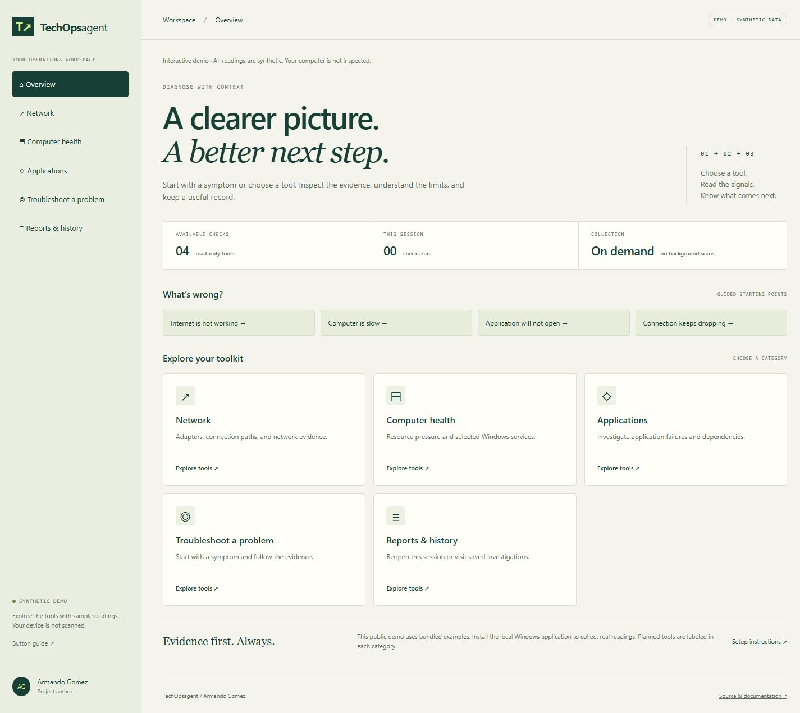
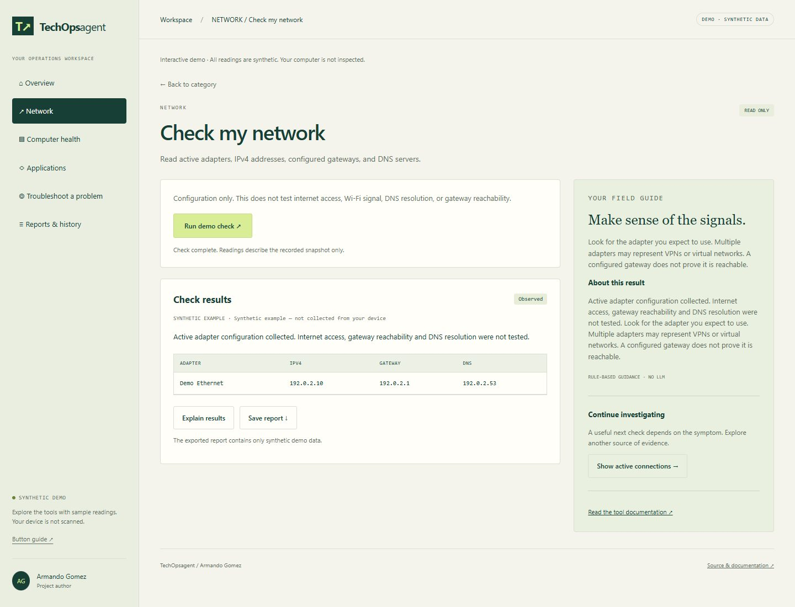
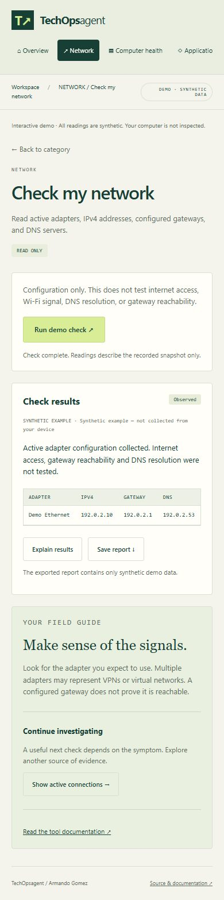

# Diagnostic toolkit: button guide
Author: Armando Gomez

## Start here
Open the [public demo](https://armandosnhu.github.io/TechOpsagent/) to explore synthetic examples. For actual Windows readings, follow [setup.md](../setup.md), run `./setup.ps1 -Run`, and open http://127.0.0.1:8765. The top badge identifies **DEMO · SYNTHETIC DATA** or **LOCAL · WINDOWS TOOLS**. Public Pages never inspects your computer. The local app has no account system and must stay bound to loopback.

## Navigation
| Button | Opens | How to use it |
|---|---|---|
| Overview | Home dashboard | Choose a symptom shortcut or category card |
| Network | Adapter/connection tools and planned network tools | Open Check my network for your first snapshot |
| Computer health | Resource readings and selected services | Start with Check computer health for a slow computer |
| Applications | Incident workspace links and planned tools | Investigate an incident for evidence and an RCA; local log import lives there |
| Troubleshoot a problem | Four available starting tools | Choose the check relevant to your symptom |
| Reports & history | Current-tab results plus saved incident investigations | Reopen a result or visit the separate incident workspace |
| All categories / Overview | Home dashboard | Return to the category menu |
| Back to category | The tool directory you came from | Choose another tool in that category |

The symptom buttons are starting points, not completed diagnoses. Internet is not working opens network configuration; Computer is slow opens resource readings; Application will not open opens selected services; Connection keeps dropping opens a TCP snapshot. Further evidence may be needed beyond this release's tools.

## Run, understand, and save
1. Choose **Network → Check my network → Open tool**.
2. Read the tool's scope above the Run button.
3. Choose **Run local check** (Windows) or **Run demo check** (synthetic example).
4. Read the result status, timestamp, summary, and table. Rerun to obtain another snapshot; there is no background polling.
5. Choose **Explain results** to show the field guide's rule-based interpretation. No LLM is running; this is not a chat model's diagnosis.
6. Choose the suggested next-tool button to continue investigating. Each tool must be run separately.
7. Choose **Save report** to download a JSON file containing the selected result, author, collection time, and limitations. Save uses your browser's download behavior. Opening or navigating to another category never uploads a report.

## Available checks
| Tool | Actual local collection | Limits and interpretation |
|---|---|---|
| Check my network | Up to 32 active Windows adapter configurations: name, IPv4, gateway, DNS servers | Configuration only; no internet, gateway, or DNS-resolution probe. Multiple VPN/virtual adapters can be normal. Missing fields say Not reported. |
| Show active connections | Up to 200 TCP endpoints, state, local/remote address and port, process name where available | Not traffic monitoring, UDP inventory, packet capture, or threat detection. A listening socket is not automatically suspicious. A truncated snapshot is labeled. |
| Check computer health | Available CPU load, memory utilization, and fixed-disk free percentages | CPU/memory over 90% or disk free below 10% produces Review needed. These are advisory thresholds, not a proven diagnosis. CPU can be absent if the OS does not report it. |
| Check Windows services | Dnscache, Dhcp, Spooler, W32Time state and startup mode | These four services do not represent all applications. Manual/trigger-start services may be stopped normally. No services are changed. |

All local collectors use fixed PowerShell commands without profile loading or user-supplied command text. The deadline is 12 seconds, with a 16-second browser request limit. Only one diagnostic can run at a time. The application never elevates privileges; insufficient Windows permissions may yield Unavailable.

## Result labels
- **Observed:** usable measurements were returned; this is not an overall health certificate.
- **Review needed:** a resource threshold was crossed; repeat the measurement and investigate context.
- **Not checked:** no usable readings were returned. It is not a pass.
- **Unavailable:** unsupported OS, permissions, missing Windows component, timeout, or collection error. No successful result is invented.

Connection/configuration tools deliberately avoid Passed because they do not prove reachability. A successful command and a healthy network are different claims.

## History and privacy
The latest 50 diagnostic snapshots stay only in the current tab's memory. Refreshing closes that session history. **Saved investigations** opens the separate SQLite-backed incident history in the local app. The public incident demo has no persistent incident history.

Local diagnostic exports can contain private IP addresses, DNS configuration, adapter/process names, and resource readings. Review them before sharing. They are not automatically redacted, stored in SQLite, committed, or uploaded. Never place real reports in tracked project files or public screenshots. Public documentation screenshots use only synthetic examples and documentation-range IP addresses.

## Planned tools
DNS resolution, website/server probes, API checks, certificate inspection, packet capture imports, and per-process resource rankings are labeled **Planned**. They have no Run button. Optional local-model chat remains future work; no model is downloaded or started by this release.

## If something does not work
- Toolkit cannot load: confirm the server is running and reload. Do not open HTML directly with `file://`.
- Check unavailable: use Windows, retry once, and inspect component/permission availability. The UI does not disclose raw command errors.
- Another check is running: wait for its bounded collection to finish, then retry.
- Results look old: check the collection timestamp and rerun; this is a snapshot dashboard.
- UI differs from documentation: use `./setup.ps1 -Check -Live` to detect an old app process, then restart the relevant foreground app.
- Download opens instead of saving: use your browser's save/download action. Files are JSON; no executable scripts are included.

